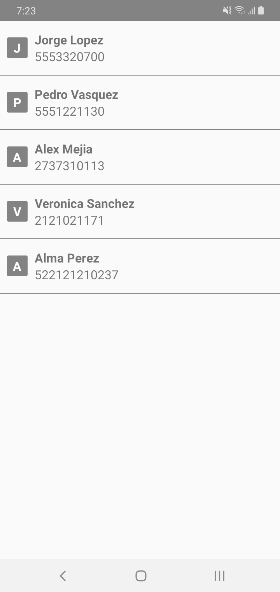
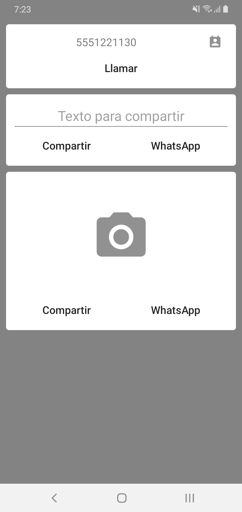
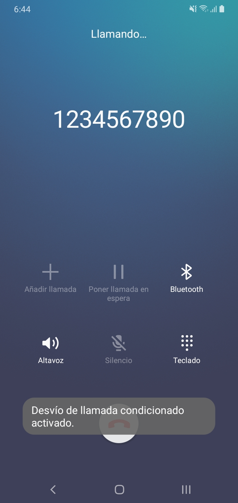
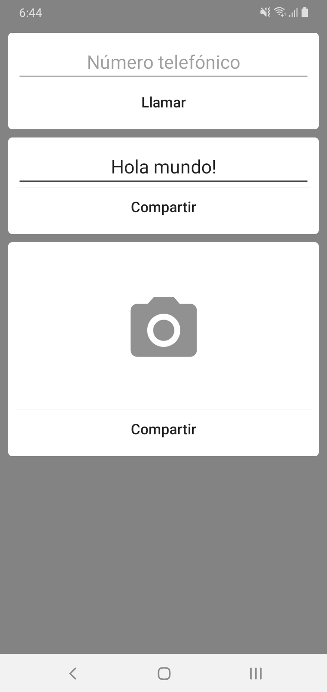
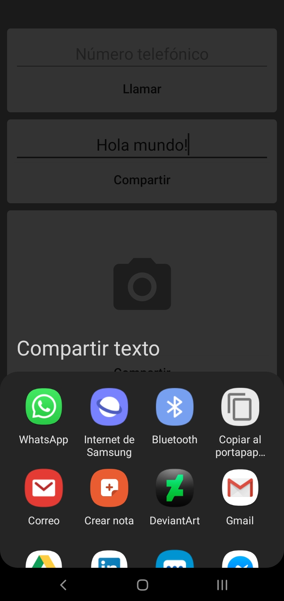
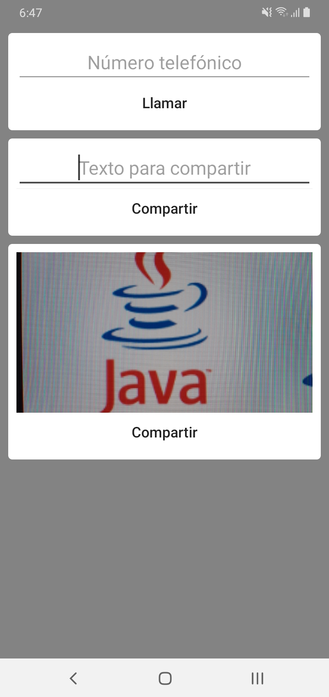

# The Gallery-Editor MVP App(Dagger version)
This is a public Android project practice to use implicit Intents to share text or images via another apps, and to make a phone call.

      
## Used tools

* Glide
* Butterknife
* Intents

## Authors

* **Miguel Angel Ochoa** - (https://github.com/developmadd)

